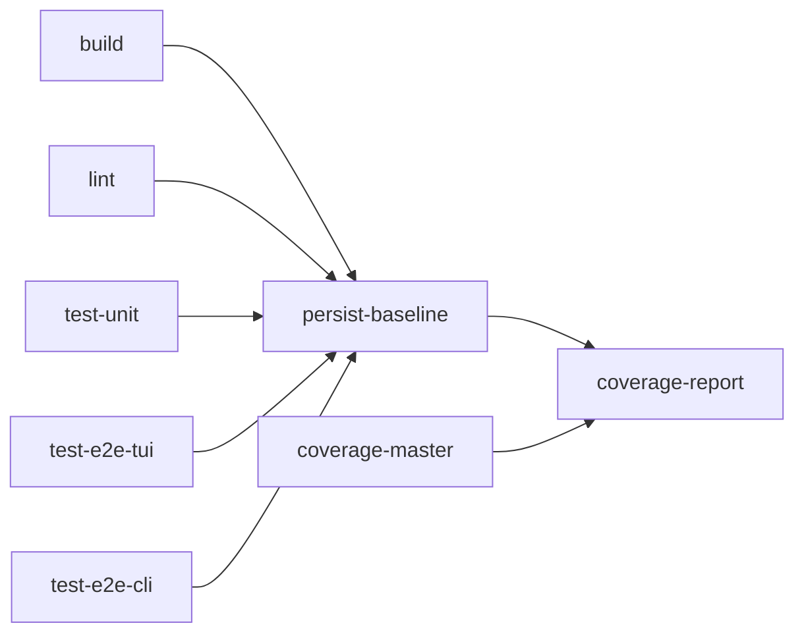

# CI & Release

## CI Pipeline

Workflow: [`.github/workflows/ci.yml`](.github/workflows/ci.yml)

Triggers: PR `opened` / `reopened` / `synchronize`, and pushes to `main`/`master`. Does **not** run on PR body/title edits.

All jobs run on GitHub-hosted **`ubuntu-latest`** runners.

### Job Order



| Job | Purpose |
|---|---|
| `build` | Compile the binary |
| `lint` | golangci-lint (`make lint-ci`) |
| `test-unit` | Unit tests with gotestsum, `-race` |
| `test-e2e-tui` | TUI e2e tests (`-tags e2e`) |
| `test-e2e-cli` | CLI e2e with coverage binary |
| `persist-baseline` | Gate after all test+lint jobs pass |
| `coverage-master` | Coverage baseline on main |
| `coverage-report` | Coverage diff reporting via `scripts/coverage-report.sh` |

## Release Validation (PR body)

Workflow: [`.github/workflows/release-validation.yml`](.github/workflows/release-validation.yml)

Triggers: PR `opened` / `reopened` / `synchronize` / `edited` (body/title edits). Uses its own concurrency group so edits do not cancel CI.

| Job | Purpose |
|---|---|
| `validate-release` | Parse `Release: vX.Y.Z` from PR body; validate semver; publish GitHub check |

## Linting

Config: [`.golangci.yaml`](.golangci.yaml)

Key enabled linters:

| Linter | Notable setting |
|---|---|
| `errcheck` | Unchecked errors |
| `gosec` | Security (via golangci-lint) |
| `gocyclo` | Complexity max 40 |
| `revive` | Go style |
| `staticcheck` | Static analysis |
| `lll` | Line length 200 |
| `interfacebloat` | Max 5 methods per interface |
| `gci`, `gofmt`, `goimports`, `golines` | Formatting |

Import grouping: standard → external → `github.com/crazy-vedic/quark`.

Local: `make lint` or `make lint ARGS="--fast"`.

## Release Automation

### Automated (on PR merge)

Workflow: [`.github/workflows/tag-on-merge.yml`](.github/workflows/tag-on-merge.yml)

Trigger: push to `main`/`master`.

Steps:

1. Find merged PR for the commit
2. Extract version from PR body line: `Release: vX.Y.Z` (or `X.Y.Z`)
3. **Validate strict +1 semver increment** against latest GitHub release (not just tag)
4. Create annotated tag + push (skip if tag exists)
5. `release` job cross-compiles 5 targets with `-ldflags="-s -w"`:
   - darwin amd64/arm64
   - linux amd64/arm64
   - windows amd64
6. Copies install scripts; publishes GitHub Release via `softprops/action-gh-release@v2`

**To skip release:** omit the `Release:` line from PR body.

### Manual Release

Workflow: [`.github/workflows/release-manual.yml`](.github/workflows/release-manual.yml)

`workflow_dispatch` to build a release from an existing tag.

## PR Template

[`.github/pull_request_template.md`](.github/pull_request_template.md)

Checklist includes:

- Self-review, style, tests
- README updates if needed
- **Agent doc updates:** "Updated cursorrules, CLAUDE.md, AGENT.md if needed" — use `.agents/` for this repo
- Breaking changes section
- **`Release: vX.Y.Z`** line for automated releases

## Version Injection

Makefile injects build metadata:

```
LDFLAGS := -X main.Version=$(VERSION) -X main.Commit=$(COMMIT) -X main.BuildTime=$(BUILD_TIME)
```

`VERSION` from `git describe --tags --always --dirty` or `"dev"`.

## Contributing Workflow

1. Branch from `main`
2. Make changes + tests
3. `make test && make lint` locally
4. Open PR with description and checklist
5. Add `Release: vX.Y.Z` if releasing (must be exactly +1 from latest release)
6. Merge → CI runs → tag + release if `Release:` present

## Agent Doc Maintenance

When making changes that affect architecture, CLI, config, or caveats:

1. Update the relevant `.agents/*.md` file(s)
2. Update [INDEX.md](INDEX.md) task router if new workflows emerge
3. Mention in PR checklist

See also: [testing.md](testing.md), [overview.md](overview.md).
